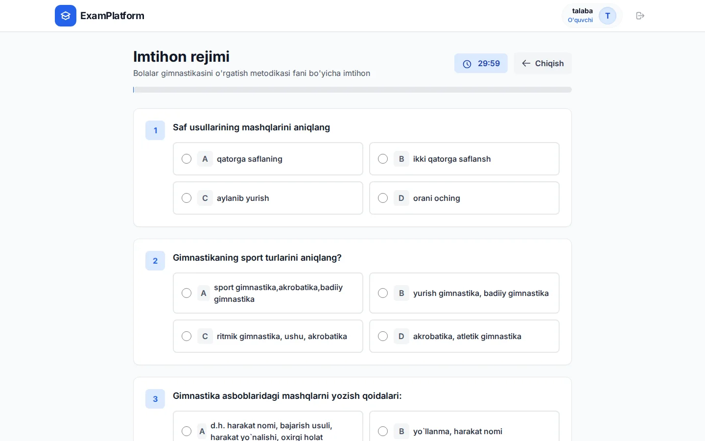
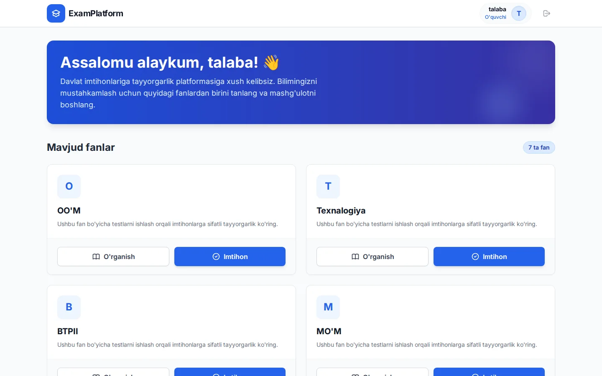
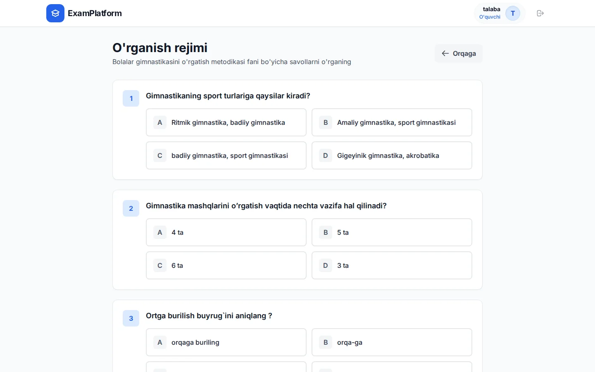
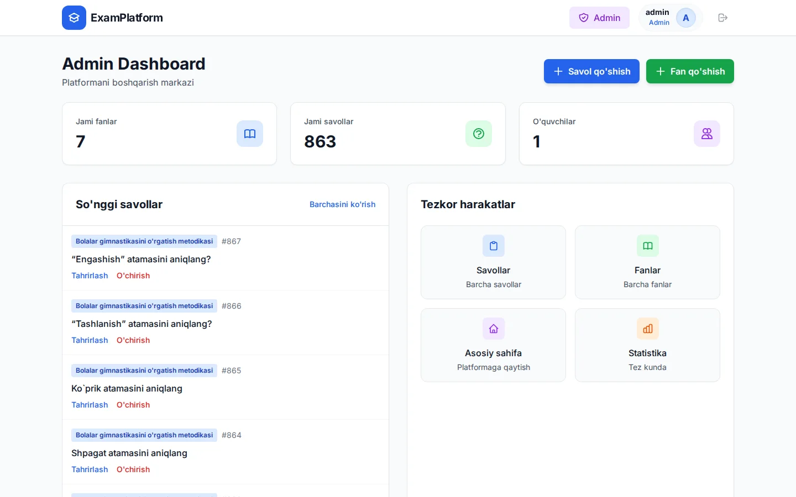
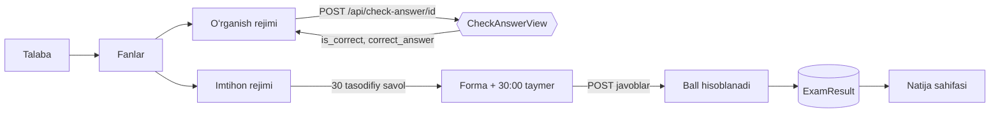
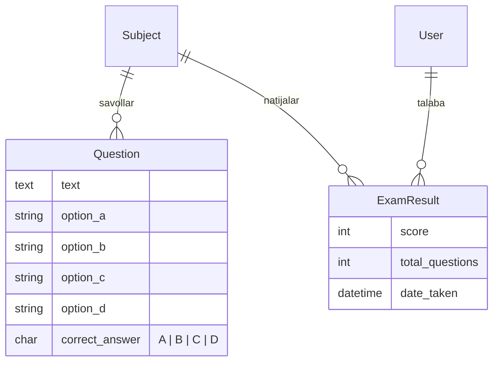

<div align="center">

# ExamPlatform

**Davlat imtihonlariga tayyorgarlik tizimi**
Fanlar boʻyicha test savollari: darhol javobni koʻrsatadigan **oʻrganish rejimi** va 30 daqiqalik **imtihon rejimi**.




</div>

---

## Mundarija

- [Nima qiladi](#nima-qiladi)
- [Skrinshotlar](#skrinshotlar)
- [Imkoniyatlar](#imkoniyatlar)
- [Texnologiyalar](#texnologiyalar)
- [Qanday ishlaydi](#qanday-ishlaydi)
- [Tez boshlash](#tez-boshlash)
- [Savollarni yuklash](#savollarni-yuklash)
- [Loyiha tuzilishi](#loyiha-tuzilishi)
- [Rivojlantirish rejasi](#rivojlantirish-rejasi)

---

## Nima qiladi

Talaba roʻyxatdan oʻtadi, fanni tanlaydi va ikki usulda tayyorlanadi:

- **Oʻrganish** — fandagi barcha savollar; variant bosilishi bilan toʻgʻri/notoʻgʻri javob darhol koʻrsatiladi.
- **Imtihon** — fandan **30 ta tasodifiy savol**, **30 daqiqa** taymer va progress-bar. Yakunda natija foizda va rangda chiqadi.

Administrator esa oʻz panelida fanlar va savollarni qoʻshadi, tahrirlaydi, oʻchiradi.

## Skrinshotlar

<table>
  <tr>
    <td width="50%"><br><sub><b>Fanlar</b> — har biri uchun “Oʻrganish” va “Imtihon”</sub></td>
    <td width="50%"><br><sub><b>Oʻrganish rejimi</b> — javob darhol tekshiriladi</sub></td>
  </tr>
  <tr>
    <td><br><sub><b>Imtihon rejimi</b> — 30 ta savol, taymer, progress-bar</sub></td>
    <td><br><sub><b>Admin panel</b> — statistika va savollar boshqaruvi</sub></td>
  </tr>
</table>

## Imkoniyatlar

**Talaba uchun**
- Roʻyxatdan oʻtish, kirish, chiqish
- Fanlar roʻyxati; har bir fan uchun ikki rejim
- **Oʻrganish rejimi:** variant tanlanganda sahifa yangilanmasdan (`fetch` → JSON) toʻgʻri javob tekshiriladi
- **Imtihon rejimi:** `ORDER BY RANDOM()` bilan har safar boshqa 30 ta savol; 30:00 taymer, javob berilgan savollar ulushini koʻrsatadigan progress-bar; topshirishdan oldin tasdiq soʻraladi, vaqt tugaganda topshirish oynasi ochiladi
- Natija sahifasi: toʻgʻri javoblar soni va foiz (≥70% yashil, ≥50% sariq, undan past qizil)

**Administrator uchun** (`is_superuser`)
- Dashboard: fanlar, savollar va talabalar soni, soʻnggi savollar
- Savollar va fanlar boʻyicha toʻliq **CRUD**, sahifalangan roʻyxatlar (20 tadan)
- Django admin: fan boʻyicha filtr, matn boʻyicha qidiruv, imtihon natijalari

## Texnologiyalar

| Nima | Vazifasi |
| --- | --- |
| **Django 6** — class-based view'lar | Marshrutlash, ORM, autentifikatsiya, admin |
| **Django Templates** | Server tomonida render qilingan sahifalar |
| **Tailwind CSS** (CDN) + `static/css/quiz.css` | Interfeys |
| **Vanilla JS** — sahifadagi skriptlar va [`static/js/quiz.js`](static/js/quiz.js) | Taymer, progress-bar, javobni tekshirish (`fetch`) |
| **SQLite** | Baza (qoʻshimcha oʻrnatish shart emas) |
| `django-cors-headers` | CORS |

## Qanday ishlaydi





## Tez boshlash

Talab: **Python 3.12+**.

```bash
# 1. Muhit va bogʻliqliklar
python -m venv venv
source venv/bin/activate              # Windows: venv\Scripts\activate
pip install -r requirements.txt

# 2. Baza va savollar (7 ta fan, 863 ta savol)
python manage.py migrate
python manage.py loaddata questions

# 3. Administrator
python manage.py createsuperuser

# 4. Ishga tushirish
python manage.py runserver
```

Sayt: <http://127.0.0.1:8000> · Admin panel: <http://127.0.0.1:8000/admin/> · Boshqaruv paneli: <http://127.0.0.1:8000/dashboard/>

> Tailwind va Inter shrifti CDN orqali yuklanadi, shuning uchun sahifalar toʻliq koʻrinishi uchun internet kerak.

## Savollarni yuklash

Yangi savollarni uch usulda qoʻshish mumkin:

1. **Admin panel** — `/dashboard/questions/add/` orqali bittalab.
2. **JSON** — [`importdata.py`](importdata.py) (`datajt*.json` → baza). Har bir element:

   ```json
   {
     "subject_id": 8,
     "text": "Savol matni",
     "option_a": "…", "option_b": "…", "option_c": "…", "option_d": "…",
     "correct_answer": "D"
   }
   ```

3. **Oddiy matn** — [`import_text.py`](import_text.py) (`text.txt` → baza). Savollar `+++++` bilan, variantlar `====` bilan ajratiladi, toʻgʻri variant boshiga `#` qoʻyiladi:

   ```text
   1. Texnologiya tushunchasi
    ====
    #biron-bir ishda qoʻllaniladigan uslublar toʻplami
    ====
    tiklash, toʻldirish
    ====
    …
    ====
    …
    +++++
   ```

Ikkala skript ham takroriy savollarni qayta yozmaydi. Fan raqami va fayl nomi skript ichida belgilangan — kerakli fanga moslab oʻzgartiring, keyin `python importdata.py` yoki `python import_text.py`.

## Loyiha tuzilishi

```text
QuizExam/
├── config/                 # settings, urls, wsgi/asgi
├── quiz/
│   ├── models.py           # Subject, Question, ExamResult
│   ├── views.py            # talaba va admin view'lari
│   ├── urls.py  admin.py
│   ├── templatetags/       # mul, div filtrlari (foiz hisobi)
│   └── fixtures/questions.json   # 7 fan, 863 savol
├── templates/              # base, home, login, register, dashboard, CRUD formalari
│   └── quiz/               # learn, exam, result
├── static/                 # css/quiz.css, js/quiz.js
├── importdata.py  import_text.py   # savollarni yuklash skriptlari
├── data1.json  data3.json  data4.json  datajt*.json  text.txt   # savollar manbalari
└── docs/screenshots/
```

## Rivojlantirish rejasi

- [ ] Sozlamalarni muhit oʻzgaruvchilariga koʻchirish (`SECRET_KEY`, `DEBUG`, `ALLOWED_HOSTS`, CORS) — hozir `config/settings.py` da dasturlash qiymatlari
- [ ] Talabaning barcha urinishlari tarixi va xatolar ustida ishlash (imtihondan keyin javoblarni koʻrib chiqish)
- [ ] Imtihon savollari sonini fan boʻyicha sozlash (hozir 30 ta)
- [ ] Avtomatik testlar (`quiz/tests.py`)
- [ ] `import_*` skriptlarini `manage.py` buyruqlariga aylantirish
